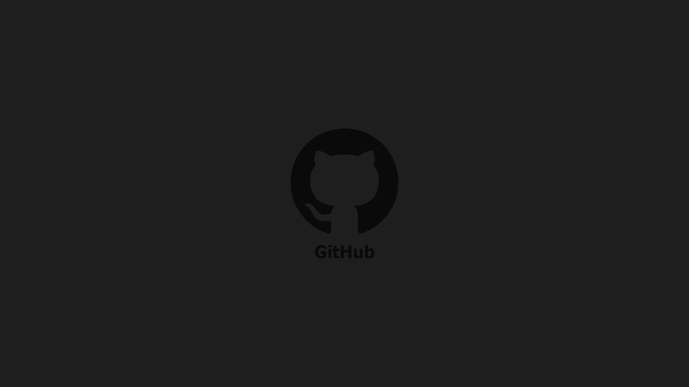

<h1 align="center">
    
</h1>

## 💻 Sobre o projeto

 Explorer Github - é uma pequena aplicação desenvolvida em REACTJS com ojetivo de consumir a api do Github para trazer os dados referente ao autor e o repositório de seu interesse.

## 🛠 Tecnologias

As seguintes ferramentas foram usadas na construção do projeto:

- [React][reactjs]
- [TypeScript][typescript]

## 🚀 Como executar o projeto

Segue a orientação abaixo:

1. yarn add || npm i (Instalação do node_modules)
2. yarn start (Para iniciar a aplicação)

## 📝 Licença

Este projeto esta sobe a licença MIT.

[typescript]: https://www.typescriptlang.org/
[reactjs]: https://reactjs.org
